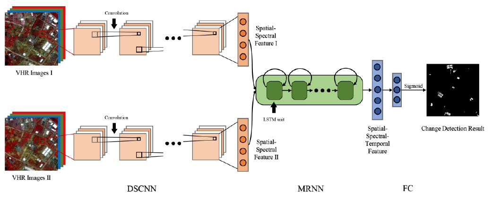
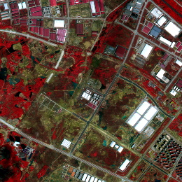
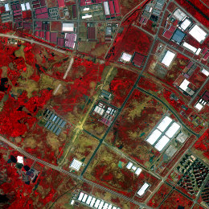
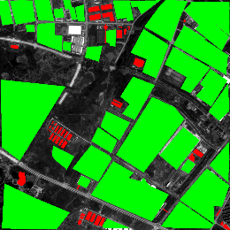
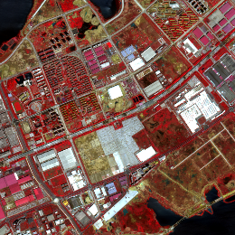
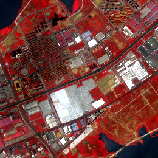
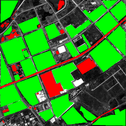
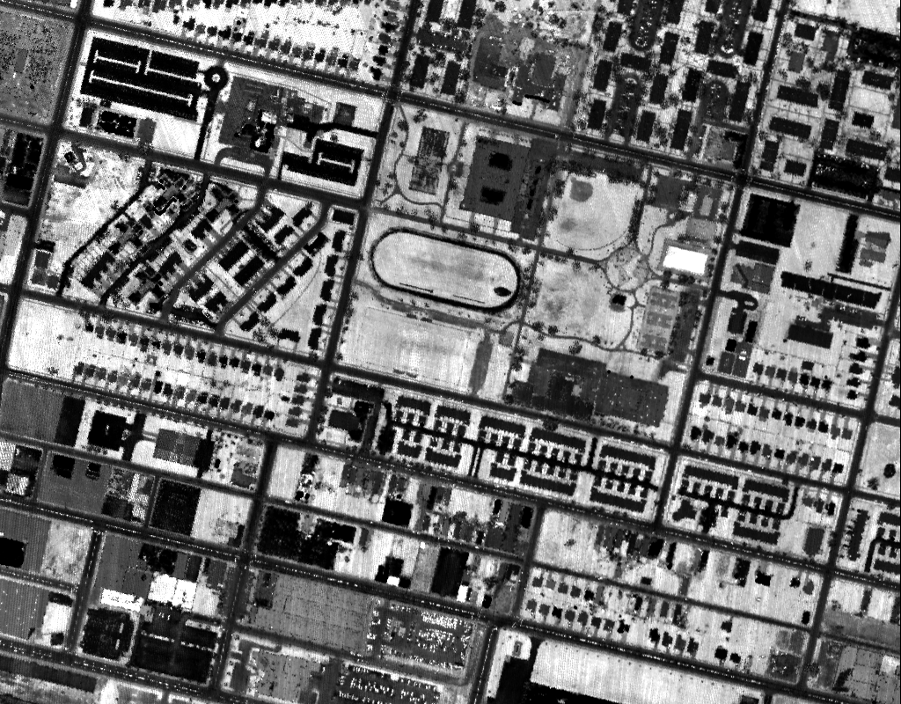
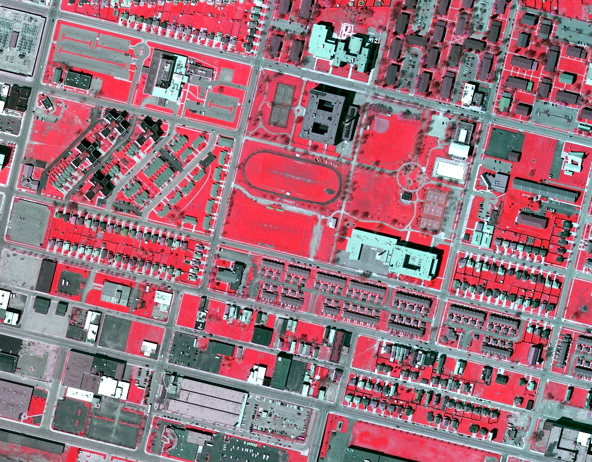
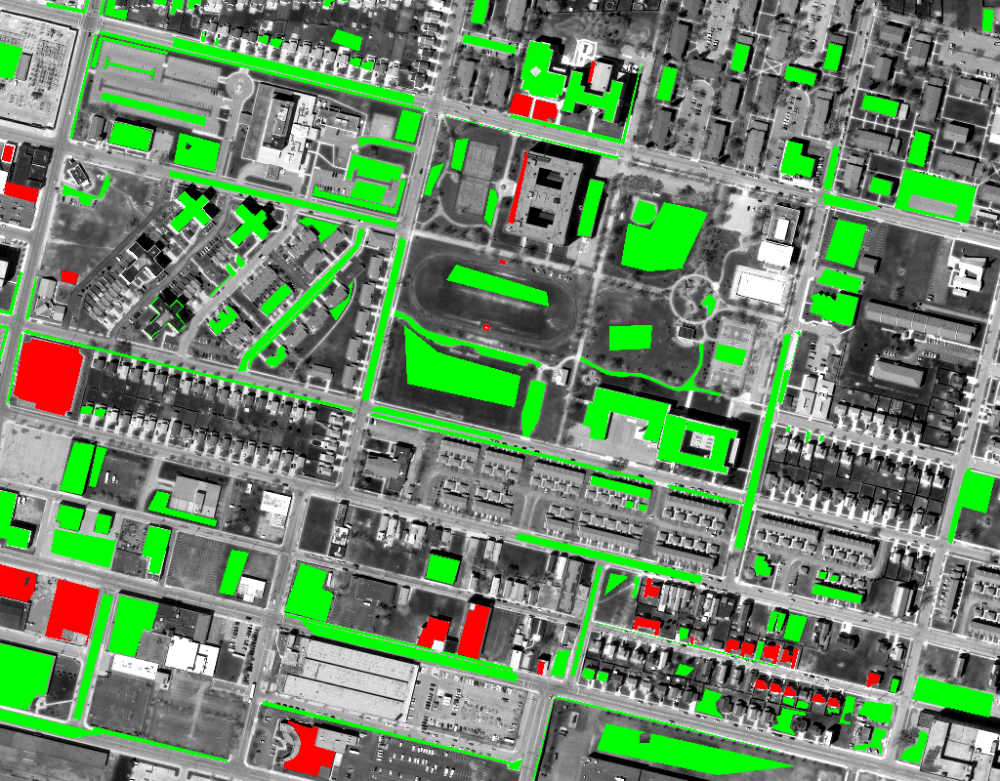

<h1 align="center">Change Detection in Multisource VHR Images via Deep Siamese Convolutional Multiple-Layers Recurrent Neural Network</h1>

<h3 align="center"> <a href="https://chrx97.com/">Hongruixuan Chen</a>, <a href="https://scholar.google.com/citations?user=DbTt_CcAAAAJ&hl=zh-CN">Chen Wu</a>, <a href="https://scholar.google.com/citations?user=Shy1gnMAAAAJ&hl=zh-CN">Bo Du</a>,
<a href="https://scholar.google.com/citations?user=vzj2hcYAAAAJ&hl=en">Liangpei Zhang</a>, and <a href="https://scholar.google.com/citations?hl=en&user=AvOyKAUAAAAJ">Le Wang</a></h3>

This is an official implementation of **SiamCRNN** framework in our IEEE TGRS 2020 paper: [Change Detection in Multisource VHR Images via Deep Siamese Convolutional Multiple-Layers Recurrent Neural Network](https://ieeexplore.ieee.org/document/8937755).


## Note
**2024.01.18**
- Wanna go beyond the patch-wise detection pipeline and apply SiamCRNN to large-scale change detection datasets? We have updated the [fully convolutional version of SiamCRNN](). Please feel free to test on the benchmark dataset.

**2023.04.25**
- The datasets Wuhan and Hanyang used in our paper have been open-sourced! You can download them [here](http://sigma.whu.edu.cn/resource.php).   


## Abstract
> With the rapid development of Earth observation technology, very-high-resolution (VHR) images from various satellite sensors are more available, which greatly enrich the data source of change detection (CD). Multisource multitemporal images can provide abundant information on observed landscapes with various physical and material views, and it is exigent to develop efficient techniques to utilize these multisource data for CD. In this article, we propose a novel and general deep siamese convolutional multiple-layers recurrent neural network (RNN) (SiamCRNN) for CD in multitemporal VHR images. Superior to most VHR image CD methods, SiamCRNN can be used for both homogeneous and heterogeneous images. Integrating the merits of both convolutional neural network (CNN) and RNN, Siam-CRNN consists of three subnetworks: deep siamese convolutional neural network (DSCNN), multiple-layers RNN (MRNN), and fully connected (FC) layers. The DSCNN has a flexible structure for multisource image and is able to extract spatial–spectral features from homogeneous or heterogeneous VHR image patches. The MRNN stacked by long-short term memory (LSTM) units is responsible for mapping the spatial–spectral features extracted by DSCNN into a new latent feature space and mining the change information between them. In addition, FC, the last part of SiamCRNN, is adopted to predict change probability. The experimental results in two homogeneous data sets and one challenging heterogeneous VHR images data set demonstrate that the promising performances of the proposed network outperform several state-of-the-art approaches.

## Network architecture



## Requirements
```
tensorflow_gpu==1.9.0
opencv==3.4.0
numpy==1.14.0
```

## Dataset
Two homogeneous datasets, Wuhan and Hanyang, and one heterogeneous dataset, Buffalo, are used in our work. The Wuhan and Hanyang datasets can be downloaded [here](http://sigma.whu.edu.cn/resource.php). For the Buffalo dataset, please request distribution from Prof. [Chen Wu](mailto:chen.wu@whu.edu.cn).
<center>

|  Dataset  |  Pre-event image  |  Post-event image  | Reference Image  |
|  :----:  |  :----:  | :----:  | :----:  |
| Wuhan  |   |   |  |
| Hanyang  |   |   |  |
| Buffalo  |   |   |  |

</center>

## Citation
If this code or dataset contributes to your research, please consider citing our paper. We appreciate your support!🙂
```
@article{Chen2020Change,
author = {Chen, Hongruixuan and Wu, Chen and Du, Bo and Zhang, Liangpei and Wang, Le},
issn = {0196-2892},
journal = {IEEE Transactions on Geoscience and Remote Sensing},
number = {4},
pages = {2848--2864},
title = {{Change Detection in Multisource VHR Images via Deep Siamese Convolutional Multiple-Layers Recurrent Neural Network}},
volume = {58},
year = {2020}
}
```

## Q & A
**For any questions, please [contact us.](mailto:Qschrx@gmail.com)**
